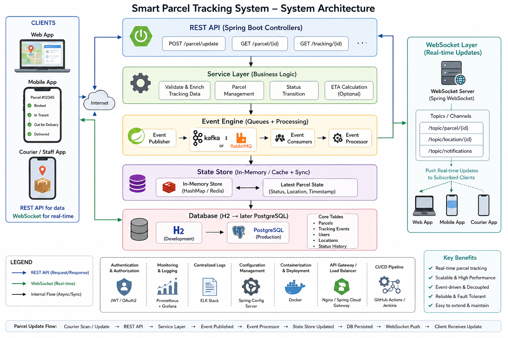
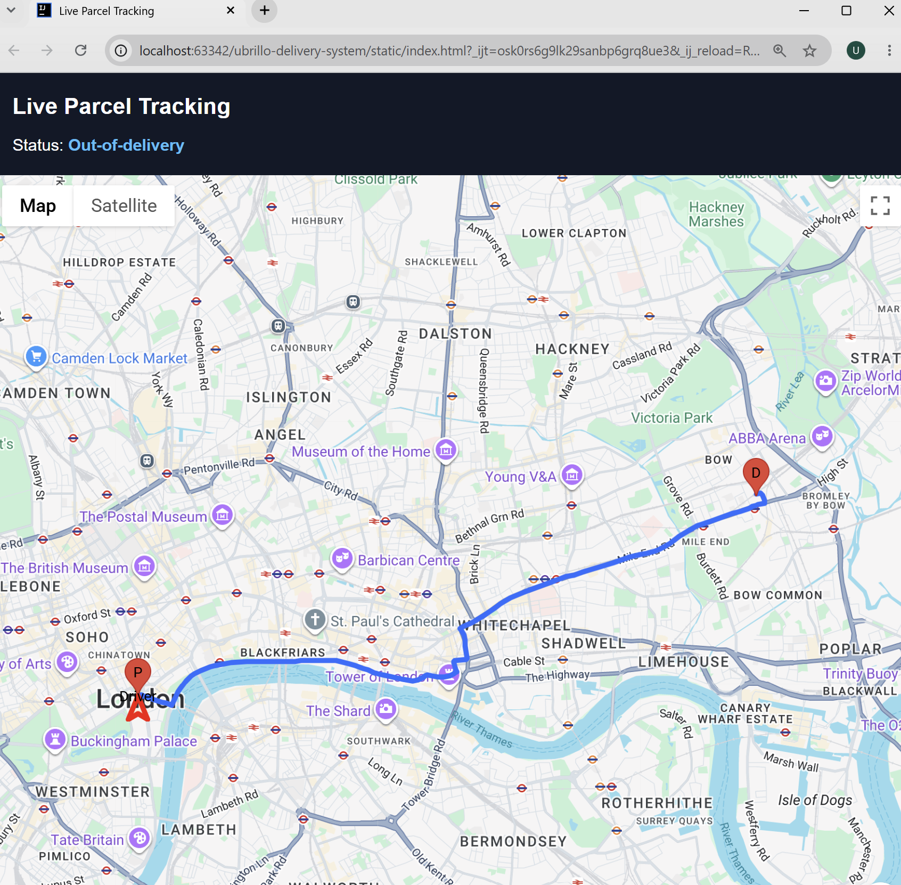

# 🚚 Distributed Real-Time Delivery Tracking System

A backend-heavy, event-driven delivery tracking platform built with **Spring Boot**, **Apache Kafka**, **Redis**, **PostgreSQL**, and **WebSockets**. The system models how real-world logistics platforms track parcels end-to-end — from dispatch to live driver location updates to delivery confirmation — with an emphasis on **concurrency, real-time data flow, and distributed state management**.

> 🚧 **Status:** Actively in development. Core real-time pipeline is functional; resilience/security features (load balancing, JWT, centralized logging) are in progress — see [Roadmap](#-roadmap--further-work) below.


---

## 📐 Architecture Overview

```
Client Layer (Web App / Mobile App)
        │  REST / WebSocket
      API Gateway / Load Balancer 
        ▼
API Gateway / Load Balancer

Spring Boot Backend
  ├── Controller Layer (REST APIs)
  ├── Service Layer (Concurrency-driven business logic)
  └── Event Publisher
        │
        ├──► Event Queue (Apache Kafka) ──► Event Processing Engine
        └──► WebSocket Gateway (Real-time updates)
                                                      │
                                                      ▼
                                       State Management Layer
                                       (ConcurrentHashMap + Redis cache)
                                                      │
                                                      ▼
                                       Database Layer — PostgreSQL (Docker)
                                       Tables: Parcels, TrackingEvents, Users
```

---

## 🛠️ Skills & Technical Highlights

This project was built to demonstrate hands-on backend engineering ability, not just framework usage:

### Concurrency & Multi-threading
- Built the service layer using **Java concurrency APIs** — `ConcurrentHashMap`, thread-safe `Lists`/`Queues`, and `synchronized` blocks — to safely handle concurrent parcel/driver updates.
- Designed **multi-threaded "worker" processes** that react to events and trigger downstream actions (a hybrid push/poll triggering model), rather than relying purely on framework-managed async handling.

### Event-Driven Architecture
- Used **Apache Kafka** as the backbone for parcel status events, decoupling ingestion (API/WebSocket) from processing (status transitions, notifications).
- Integrated an **email notification system** triggered directly off Kafka events when a parcel's status changes.

### Real-Time Communication
- Implemented **WebSockets** for bi-directional live updates: drivers push location updates, and subscribed users receive instant tracking changes — no polling.

### Caching & State Management
- Built a **hybrid state store**: an in-memory `ConcurrentHashMap` layer for fast local access, backed by **Redis (Dockerized)** for shared, persistent caching across instances.

### Data Persistence
- **PostgreSQL** (Dockerized) as the system of record, with schema covering `Parcels`, `TrackingEvents`, and `Users`.

### Frontend / Integration
- Built a **web dashboard** (HTML/CSS) integrating **Google Maps/Geocoding APIs** to resolve user postcodes and render live tracking visually.
- Planning to migrate this dashboard to **JavaFX** for a richer native client experience.

---


## 🔄 How It Works

1. **Order placement** — A user places an order via the REST API. The **Controller Layer** receives the request and passes it to the **Service Layer**.
2. **Creation & persistence** — The service layer creates the order, persists it to **PostgreSQL**, and seeds an entry in the **cache** (ConcurrentHashMap + Redis).
3. **Order list / cancellation window** — The new order sits briefly in an **order list** — a temporary, thread-safe staging structure that gives the user a window to cancel before fulfillment begins.
4. **Dispatch queue** — Once the cancellation window closes, the order is automatically moved to the **dispatch queue**.
5. **Staging & sortation** — Multi-threaded **worker processes** pick orders off the queue, move them into staging zones, and perform sortation concurrently — modeling how a real warehouse/depot would batch and route parcels.
6. **Status events & notifications** — At each stage transition (*created → dispatched → out for delivery → delivered*), an event is published to **Kafka**. The **Event Processing Engine** consumes these events, updates order status, and triggers **email notifications** to the user.
7. **Geocoding** — The user's postcode is resolved to geographic coordinates via the **Google Maps/Geocoding API**, enabling map-based tracking on the dashboard.
8. **Live driver updates** — Drivers send GPS location updates over a **WebSocket** connection as they move.
9. **Live user tracking** — Users track their order in real time over a separate **WebSocket** connection, receiving instant position and status updates with no polling required — all rendered live on the **dashboard**.

---

## 🗄️ Data Model (Core Tables)

- **Orders** — order metadata, current status, assigned driver, order status, customer name


---

## ✅ Implemention

| Component | Technology |
|---|---|
| REST API | Spring Boot |
| Concurrency / Worker logic | Java Concurrency APIs (ConcurrentHashMap, synchronized, multi-threading) |
| Caching / State Store | ConcurrentHashMap + Redis (Docker) |
| Database | PostgreSQL (Docker) |
| Messaging / Events | Apache Kafka |
| Real-time updates | WebSockets |
| Notifications | Email integration via Kafka events |
| Dashboard | HTML/CSS + Google Maps API (postcode resolution, live tracking) |

---

## 📌 Roadmap / Further Work

- [ ] API Gateway / Load Balancer (Spring Cloud Gateway / Nginx)
- [ ] JWT-based authentication & authorization
- [ ] Centralized logging (e.g. SLF4J + ELK or similar)
- [ ] Migrate dashboard from HTML/CSS to JavaFX
- [ ] Add metrics/monitoring (Prometheus + Grafana)
- [ ] Containerize full stack with Docker Compose / Kubernetes

---

## 🚀 Getting Started

```bash
# Clone the repository
git clone https://github.com/<your-username>/distributed-realtime-delivery-tracking.git
cd distributed-realtime-delivery-tracking

# Spin up Kafka, Redis, and PostgreSQL via Docker
docker-compose up -d

# Run the Spring Boot application
./mvnw spring-boot:run
```

API available at `http://localhost:8080`. WebSocket tracking updates available at `ws://localhost:8080/ws/tracking`.

---

